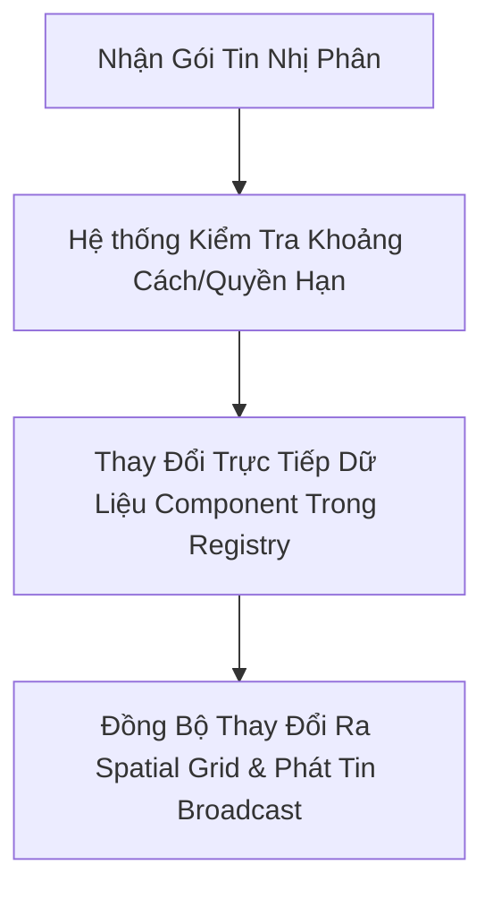

# ECS Industry Standards & Codebase Guide for DeepSeek V4 Pro / Cline

Tài liệu này cung cấp hướng dẫn sâu về cách hiểu, bảo trì và phát triển mã nguồn MMO Server của **Minnsun's Adventure** dựa trên các tiêu chuẩn công nghiệp về kiến trúc **Entity-Component-System (ECS)**.

---

## 1. Bản Đồ Thành Phần (Components Atlas)

Dữ liệu của thực thể được tách hoàn toàn thành các Component đơn giản, cấu trúc dạng struct phẳng:

*   **Vị trí & Không gian**:
    *   [PositionComponent](file:///c:/Minnsun's Adventure/server/ecs/ecs.go): Lưu trữ tọa độ `X`, `Z` kiểu `int32` và `MapID` kiểu `int32`.
    *   **Spatial Grid**: Tọa độ được hash thành các ChunkKey thông qua `systems.GlobalSpatialGrid` để tối ưu hóa truy vấn lân cận O(1) phục vụ phát tin (broadcasting) và AI.
*   **Chỉ số & Chiến đấu**:
    *   [StatsComponent](file:///c:/Minnsun's Adventure/server/ecs/ecs.go): Lưu trữ `HP` hiện tại, `MaxHP`, `Damage` gốc và các chỉ số đã qua tính toán.
    *   **Stat Engine**: Hệ thống `RecalculateActiveStats` là nguồn chân lý duy nhất tính toán lại HP/Sát thương thực tế sau khi gộp chỉ số cơ bản với chỉ số từ `EquipmentComponent`.
*   **Túi đồ & Trang bị**:
    *   [InventoryComponent](file:///c:/Minnsun's Adventure/server/ecs/inventory_component.go): Lưu trữ số lượng vật phẩm dựa trên TemplateID.
    *   [EquipmentComponent](file:///c:/Minnsun's Adventure/server/ecs/equipment_component.go): Lưu trữ ID thực thể trang bị ở các ô (Weapon, Armor).
*   **Vòng đời & AI**:
    *   [AIComponent](file:///c:/Minnsun's Adventure/server/ecs/ecs.go): Máy trạng thái AI (Idle, Roaming, Chasing, Attacking, Returning).
    *   [LifetimeComponent](file:///c:/Minnsun's Adventure/server/ecs/lifetime_component.go): Theo dõi thời gian tồn tại của các thực thể tạm thời (Ground items).

---

## 2. Quy Trình Vận Hành Một Giao Dịch ECS Chuẩn

Khi viết một tính năng mới (ví dụ: Hệ thống giao dịch giữa hai người chơi, hệ thống kỹ năng), hãy tuân thủ quy trình 3 bước:

1.  **Validation (Kiểm tra)**: Truy vấn Component của thực thể thực hiện hành động.
    *   *Ví dụ nhặt đồ*: Đọc `PositionComponent` của Player và `PositionComponent` của Item rơi trên đất, đo khoảng cách.
2.  **State Mutation (Biến đổi trạng thái)**:
    *   Thực hiện sửa đổi dữ liệu trực tiếp trên các Component thông qua Registry.
    *   Sử dụng cơ chế an toàn luồng `TypedSyncMap` để `Load`, `Store` hoặc `Delete`.
3.  **Synchronization & Feedback (Đồng bộ & Phản hồi)**:
    *   Nếu tọa độ thay đổi, cập nhật `GlobalSpatialGrid` (sử dụng hàm `Update` hoặc `Remove` rồi `Insert`).
    *   Phát thông báo hoặc gửi gói tin nhị phân phản hồi trạng thái mới về Client để đồng bộ giao diện hiển thị.

---

## 3. Các Điểm Cần Tránh Khi Code Với ECS Go

*   **Tránh Cấp Phát Bộ Nhớ Trong Vòng Lặp Chính**:
    Không dùng các câu lệnh khai báo mảng/map động `make([]T, 0)` hoặc `make(map[K]V)` trực tiếp trong game loop. Bắt buộc phải mượn từ `sync.Pool` và trả lại (sau khi đã `clear()` hoặc reset slice len về 0).
*   **Tránh Đọc Ghi Đồng Thời Không An Toàn**:
    Mặc dù Registry sử dụng `TypedSyncMap` tự quản lý khóa trong từng Component riêng biệt, nhưng việc thay đổi chéo nhiều Component của các thực thể khác nhau cần được xem xét cẩn thận để tránh race condition ở mức logic ứng dụng.
*   **Đồng Bộ Packet Khi Sửa Đổi Chỉ Số**:
    Bất kỳ thay đổi nào liên quan đến sinh mệnh (`HP`), trang bị, hoặc tọa độ của thực thể đều phải kích hoạt hệ thống phát tin tương ứng về Client đứng chung map để tránh lỗi "bóng ma giao diện" (đồng bộ lệch trạng thái).
